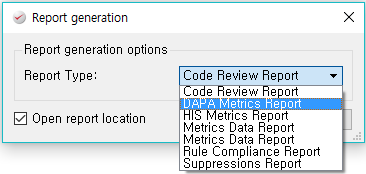

# QAC Plugin - DAPA Metrics Report Generation

This is PRQA Framework Plugin for generating Report based on DAPA Source Code Metrics criteria.

## Overview

You can simply generate DAPA Metrics Report by clicking the menu [Report]-[Generate Report for Project: "~~~" ] in PRQA Framework.

In the report, you can see what functions exceeded the criteria of DAPA Source Code Metrics.
The value of metrics is highlighted by red if the function exceeded the limitation of the Metrics.

## Usage

You have to copy these to `c:\PRQA\PRQA-Framework-2.x.x\report_plugins` directory.
  * `DAPA_Metrics_Report.py` file
  *  `lib` directory

## Note

`lib` directory include python libraries: `openpyxl`, `jdcal`, `et_xmlfile`

  * openpyxl 2.6.1 https://pypi.org/project/openpyxl/#files
  * jdcal 1.4.1 https://pypi.org/project/jdcal/#files
  * et_xmlfile 1.0.1 https://pypi.org/project/et_xmlfile/
